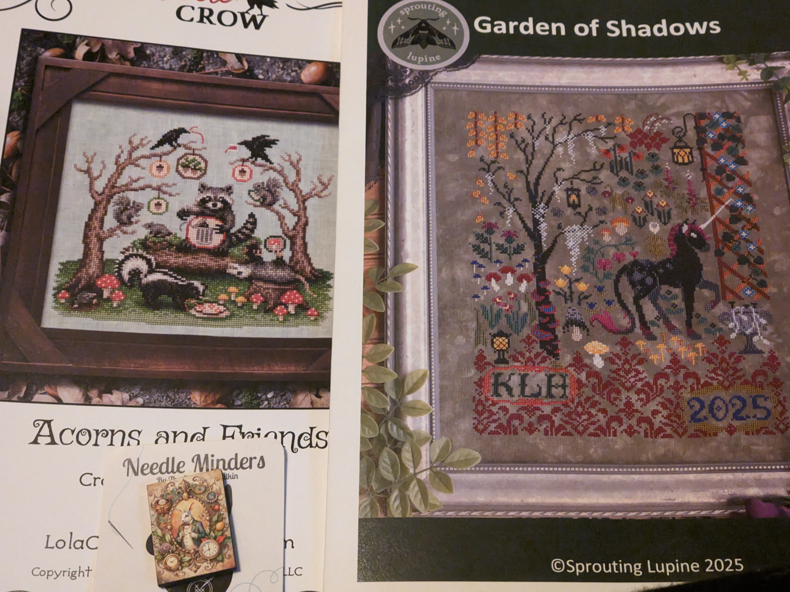
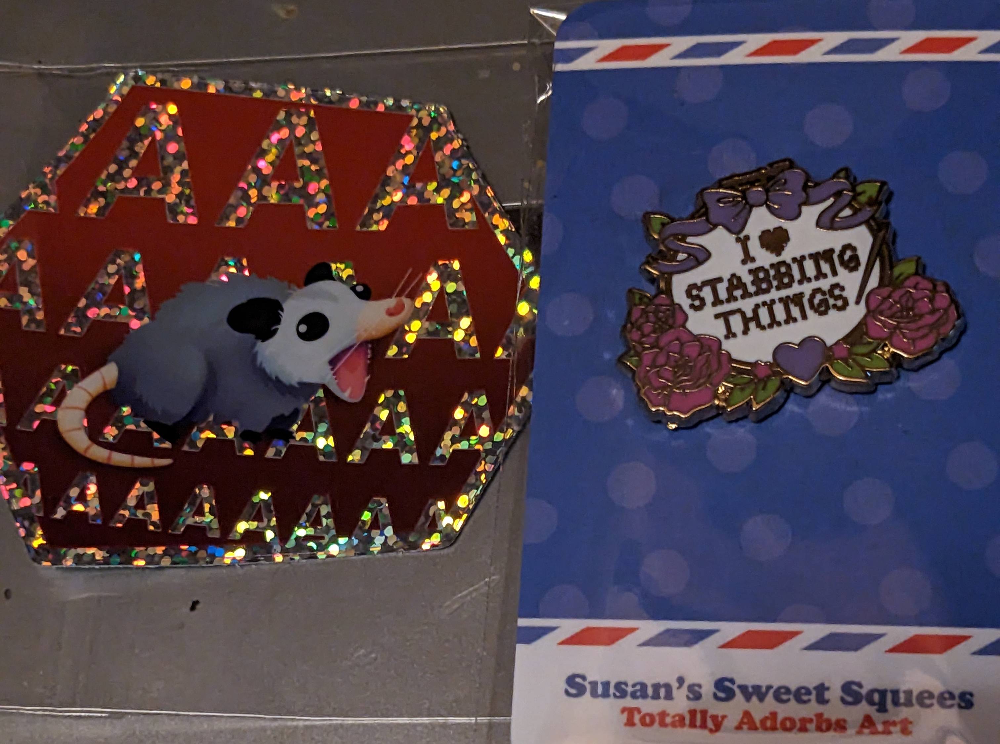

I'm not going to make a long post this week. The most exciting thing
that happened was going to see Spinal Tap 2. The original is a family
favorite film and I couldn't pass on it. It isn't as good as the first but
there are more than a few laughs. I think if you are a fan it is worth
going to see.

## WIPs

The only thing that I worked on this week was my math Quaker. Working
from a pattern of my own design. I completed the surface integral
the other day. That is the symbol that looks like two s's with a ring around them.
Coincidentally, it also looks like my initials. So, I often use it as
my signature.

I am working monogamously on it for the moment putting aside
other projects. I'd like to get it done this month and hang it on my wall.
I'm very motivated.

This is what it is looking like.

## Haul

I have some things to share this week. Mostly charts that I ordered
last month. They arrived this week. Five charts in total.

I ordered these items from the same store. I'm turning the pin into
a needle minder. It is too perfect. The sticker is a representation of my
stress and anxiety. I amm feeling like that little possum right now.

## Plans

Staying the course and working on my Quaker.
