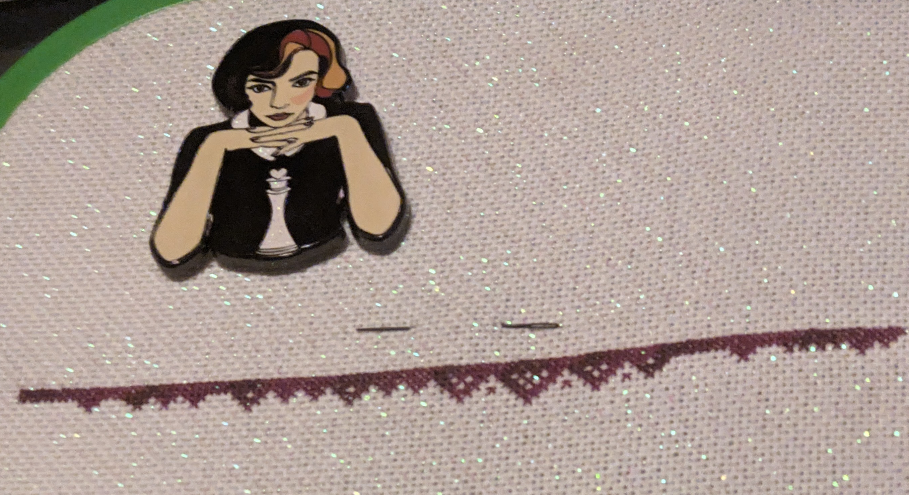

Well, wasn't sure what to call this as Flosstube is for YouTube
videos and this is not one of them. I was talking with my mom about what
to call my weekly updates for the cross stitch blog. Jokingly, I suggestedd
Cross Stitch Bonanza and it stuck. It seems appropriate because
it is a term that comes from the mining of precious metals. When you
would find a substantial amount. Also, it is a popular western television show
in the US. Which appeals to the part of me that loves a
pop culture reference. I may change what I call this in
the future.

## WIP Updates

I've only worked on one WIP this week. This was the
Floral Dragon SAL from Flossy Fox Shop. The first pattern
dropped on August 10th. With each new pattern realizing on the 10th
of the month until January. It is not too late to join if my
finish entices you. But, yes, it is a finish for part one. it
took me about two weeks to complete 3,552 stitches. I averaged
about 300 a day. Here is the completed piece.

pattern: [Floral Meadow SAL](https://www.etsy.com/listing/4322334131/flower-dragon-meadow-stitch-along-6)

fabric: 32 Count Stonehenge Lugana from Atomic Ranch

needle minder: DIY [Sakura Dwagon Enamel Pin](https://www.etsy.com/listing/1305083087/original-dragon-pins-set-1-rainbow-heart?ref=yr_purchases) frrom All the Dwagons

## New starts

I had a finish and made a new start. This new project is
a Long Dog Sampler. I'm completing Opening Gambit which is
chess themed. It was the only one that appealed to me because
it is related to math. It is also featured in Through the Looking Glass
the sequel to Alice in Wonderland. So, it is the most meaningful
pattern to me. There is one with a Tapir in it and that is also calling me.

Here is my start for this month.

pattern: [Opening Gambit](https://www.longdogsampler.com/product/opening-gambit/)

fabric: 25 Count White Opalescent Lugana by Zweigart

needle minder: DIY [The Queen's Gambit: Beth Harmon Enamel Pin](https://www.etsy.com/listing/892043072/the-queens-gambit-beth-harmon-enamel-pin?ref=yr_purchases) frrom Holly with a whyyy

One thing that I noticed is that this pattern is not symmetrical. Which takes a little more thought. I am a bit
concerned doing one over one on fabric that isn't gridded. We will see how this goes. Right now, I love the fabric
and it is a manageable size. I prefer this to 40 count.

## Plans

Working on my Floral Dragon got me thinking about changing how
I rotate through projects. The new plan is to pick one piece
and work on it for a week for at least 1,000 stitches. That way, I still
feel like I'm making progress. Getting a finish felt good but I still
want variety and choice. This seems like a good way to manage that.

The next piece that I want to work on is [The Stitchers Book Club by Cloudsfactory](https://cloudsfactory.net/the-stitchers-book-club-cross-stitch-pattern.html).
My original thought was that I would pick it back up when the SAL completed. But,
this month was Jules Verne. And, I cannot resist it any longer. I love the authors so much
and it is very cute. I also love the fabric that I chose for it. So, I'm
going to work on that for a week.

This is where I left it as a reminder.

Then, I'm going to move onto the Japan Quaker which is a gift for a friend.

This is how it is going so far.

I'm going to continue working on Opening Gambit. I'm going to make it a
thread or two thread a day project. That way, it will eventually get done.
I think it is something like 20,000 stiches. So it is going to take years.

## Haul

Only a little bit of haul to share. I am fond of making
my own needle minders out of enamel pins. And, I am a sucker
for a dragon. I bought a few more pins from All the Dwagons.

The one on the left is listed as an asian dragon, but the reference seems to be Haku from Spirited Away.

The pin in the middle is Smaug from the Hobbit.

The last one on the right is Tiamat, an infamous monster and deity from Dungeons & Dragons.

I cannot wait to use thee on my cross stitch projects! Look out
for them in future updates.

What are you working on?
