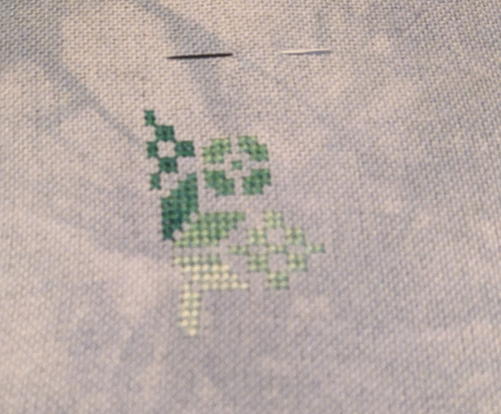

Well, a new month and another new start. I could not
help myself this time. I got too excited! This was a few months in the
planning. I had this idea after completing my [Stitcher's Quaker](https://123stitch.com/item/Luminous-Fiber-Arts-A-Stitchers-Quaker-Cross-Stitch-Pattern/LFA-020).
This style appeals to me, probably because of the geometry of some
of the pattern.

Quakers lend themselves to themes. We've seen the seasonal ones. The
[Halloween one by Lila's Studio](https://123stitch.com/item/Lilas-Studio-Halloween-Quaker-Cross-Stitch-Pattern/17-2029) is very popular.
I recently bought a [fruit salad theme from Primrose Cottage](https://123stitch.com/item/Primrose-Cottage-Stitches-Fruit-Salad-Quaker-Cross-Stitch-Pattern/PRIM-048).
It made sense that a math Quaker would not be hard to do.

I wasn't sure how to do some of the traditional motifs. I didn't think thatI
could design them myself. I [purchased the book](https://www.amazon.com/dp/1800921802?ref_=ppx_hzsearch_conn_dt_b_fed_asin_title_1). "Quaker Samplers: The Ultimate Collection of Traditional and Modern Designs."
It has many practical patterns that you can ues to create your
own Quaker sampler. Because of this, I won't be able to publish my pattern and
put it on the web. I don't want to share copyrighted material.

But, I designed some math motifs! I will share those with people
who are interested. I'm very proud of my design for the Sierpiński triangle.
It is a well-known example of a fractal.

Well, that is the background for this start and the origin.

Featured here are the first 147 stitches of A Mathematician's Quaker.

I'm stitching it on 32 count Lugana in the color Blue Ridge from Atomic Ranch.
The green is a variegated floss from DMC, number 125.
