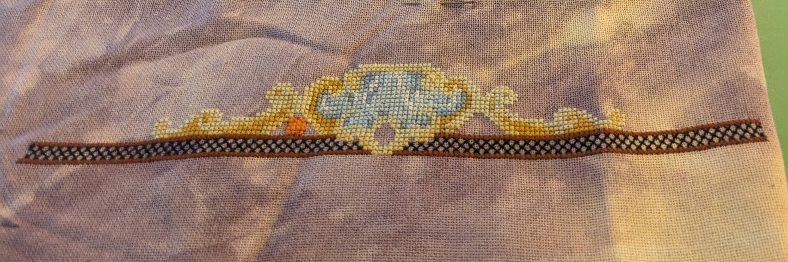

Hi, welcome to my first blog! I know, it is strange, a blog about cross stitch. Why not start a Flosstube? Truth of it is
I don't like the way I appear in video. And, if I wasn't going to show my face, it didn't make sense to do video. I much prefer written
conversation where I am more capable of speaking my mind. It helps me avoid misunderstandings and I feel more comfortable.

I may do an Instagram in the future. I'm not fond of Meta and I hear that hashtags aren't working great right now. So, it might be
too late to find community there. But, if you want to connect with me on a more regular basis you can find me in the [Catkin and Lillie
Patreon](https://www.patreon.com/catkinandlillie) chat. I'm pretty active and there are some awesome people and projects to see.

## WIP Parade

It is the time of year when people do their half way through the year Wip Parade. I'm late to the part of course. But, it is never too
late and this seemed like a great way to introduce people to my work. So, here are my WiPs in chronological order.

### OwlForest Embroidery Alice in Wonderland SAL

This SAL is over and was finished years ago. I'm not sure when it was active. The nice thing is that [OwlForest Embroidery released
it as a free pattern](https://owlforest.co.uk/besplatnaya-skhema-dlya-vyshivaniya-alisa-v-strane-chudes/). It is much prettier in the OwlForest Embroidery threads, but it is okay in the DMC. I chose
the DMC conversion because I could buy the floss locally.

I've stitched this in the called for fabric color but chose lugana over the linen. It is 32 count Vintage Country Mocha by Zweigart.
I started this project in April of 2025. It is a big one!

I also wanted to share a close up on the white rabbit who is adorable. I love him. You can't see this level of detail in the full
image. This might give you a better idea of what it will look like in the DMC. The next section is Alice tumbling through the rabbit hole.

### The Stitchers Book Club SAL

I saw Kat of Catkin and Lillie working on this and fell in love. There is not an author so far that I have not read. There are several
whose books I love. I don't want to spoil it too much, but they do have an Alice and Willy Wonka reference. The details are
very thoughtful and how the sections play off each other keeps things interesting.

You can get the [pattern for The Stichers Book Club ](https://cloudsfactory.net/the-stitchers-book-club-cross-stitch-pattern.html) from Cloudsfactory.

I am using the called for DMC but not the fabric. I didn't want to go with a neutral color. So, I chose Tea Rose from Atomic Ranch. It
is a 32 count linen. I think it gives the piece of a vintage feel. Which reminds me of going to the used bookstore when I was a kid.
I'm really loving it on this fabric. Since I started late, I'm not completing it in the order it came out. That is why it might look
different than others.

This project was started in May of 2025

### Cats And Mandalas August

This is a present that I am making for my mother. She wanted something with a cat. I chose this pattern because it also has sunflowers.
I have a thing for sunflowers. So, I thought it would remind here of me when she sees it. This is my first time working with metallic
threads and it hasn't been so bad. But, I've also watch a lot of Flosstube videos about working with them. I am loving the sparkle
they give. Though, I think it is hard to see in photos.

The pattern is [Colorful Cats - Cats And Mandalas August](https://123stitch.com/item/Kitty-And-Me-Colorful-Cats-Cats-And-Mandalas-August-Cross-Stitch-Patt/KAM-106) by Kitty And Me.

It is stitched on a 28 count lugana from Zweigart using the all the called for. This project was started in June of 2025.

### Nightingale

This is my first fancy lady! It is a Mirabilia pattern. It is inspired by Florence Nightingale. People may not know, but she made
an important contribution to data visualization with her Nightingale diagrams. One of the rare times you will find a cross stitch of
someone in math history. As a math person, it was important for me to work on this project.

The [Nightingale Mirabillia pattern](https://123stitch.com/item/Mirabilia-Nightingale-Cross-Stitch-Pattern/MD185).

i haven't gotten very far as I got distracted by other projects. I've made a few more starts this year. I'm finding that I'm less concerned
about finishing projects as having a choice of what to work on. Though, I think that I'm starting to slow down now. I'm quite
satisfied with what I have in my pile.

This is stitched on 28 count Blueberry lugana from Fiber on a Whim. It was started in June of 2025.

### Dragon Quaker

I like the Quaker style and there seems to be a pattern for any subject matter. I am a sucker for dragons. I did a quick Google search
and found this [Dragon Quaker from Wiehenburg Design](https://www.wiehenburg-design.com/quaker-style-samplers/dragon-quaker/). I fell
in love and wanted to start this right away.

My biggest issue is that I started this on 40 count. There was a learning curve that caused a lot of frustration. I did figure it out
and it is doable. The issue for me was that I started on a light fabric. Switched to something darker and like the look better. But,
there isn't as much contrast. I'm going to keep going with it.

This is stitched on 40 count Earth linen from Fiber on a Whim. I converted the silks to DMC using my own conversion. It was started in June 2025.

### Black Wing Haberdashery

This pattern was started for the Catkin and Lillie SAL. It is a SAL not based on a pattern so much as doing a project about stitching.
I already had this [Black Wing Haberdashery pattern from Lindy Stitches](https://123stitch.com/item/Lindy-Stitches-Black-Wing-Haberdashery-Halloween-Cross-Stitch-Pattern/LS-089) in my stash. So, I went with it. I am two months in now. We are'
doing it in seven parts. Many people in the group, including Kat, are doing [Stitching Rules from Primrose Cottage](https://123stitch.com/item/Primrose-Cottage-Stitches-Stitching-Rules-Cross-Stitch-Pattern/PRIM-041).

It is being stitched on 32 count Silvery Moon lugana by Wichelt using the called for DMC. It was started in July of 2025.

### Quaker du Japan

This is the second gift that I'm working on. I'm making it for my best friend. I'm not sure she will ever display it but that
isn't the point. I wanted to give her something hand made with a lot of love. It does have a sentimental meaning. Frequently, she visits
Japan around Christmas time. Including visiting a theme park near Mount Fuji. She is planning on going again this year. I'm hoping
to have it done before then.

The [Quaker du Japan pattern](https://www.jardinprive.com/produit.php?mod=Quaker-du-Japon) is from Jardin Prive.

This is stitched on a 36 count Cherry Pink linen by Hand Dyed by Rolanda. It was started in July of 2025.

### Wibbly Wobbly Timey Wimey

Well, I hope you recognize that quote. If not, it is Doctor Who! This is how Ten describes time. Now a classic quote of the
series. As expected, this design features many references to the show. It is the Weeping Angel that got my attention.

The [pattern is from the Black Needle Society](https://www.theblackneedlesociety.com/products/vault-25?_pos=1&_sid=3be4a83fd&_ss=r) and you should check it out and see how many references you can find.

This project is special to me because it is the first time that I'm using silks. It is a bit slippery but not too bad.

It is stitched on the called for fabric, 32 count Blue Moon linen from BeStitchMe. This piece was started in July of 2025.

### Halloween Horse

This isn't the name of the pattern. It doesn't have one really. It was horse featured for the month of October in the book, "Carousel Horses in Cross-Stitch: Beautiful Projects for Every Month of the Year" by Donna Kooler. You
can find this book used in many places.

I'm not sure if I'm going to continue with this project. The pattern has misprints. Some
stitches are marked with the wrong symbols. So you have to use context to choose the correct color. Mostly by looking at surrounding
stitches. But, it makes my head hurt and complicates something that I do for relaxation. But, I'm listing it as a WIP for now.

It is stitched on a 28 count Heather lugana by Picture This Plus using called for DMC. This project was also started in July of 2025.

### Floral Dragon Meadow SAL

My last project is the [Floral Dragon Meadow SAL](https://www.etsy.com/listing/4322334131/flower-dragon-meadow-stitch-along-6?ref=shop_home_feat_1&pro=1&sts=1&logging_key=f85cf696ab70cc9c87be3ad63fbd53987cccd5ef%3A4322334131) by Flossy Fox Shop.

Like I said, a sucker for dragons. Flossy Fox Shop does a lot of patterns that feature them. When I was look at their ETSY, I saw this listing.
It started August 10th and I already had the fabric. So, I decided to start it this month. The first dragon is a cherry blossom dragon.

I'm stitching this on 32 count Stonehenge lugana from Atomic Ranch in the called for DMC.

## Plans

I am going to keep going on my Floral Dragon until I complete it. Hopefully, only one more week. Then I'm going back to The Stitchers Book Club.
I'm changing up how I rotate through projects. I'm going to work them one week at a time. I like that feeling of progress even if it will
take more time to finish. Next month, I'm starting my first Long Dog Samplers on a 25 count one over one. The [pattern is Opening Gambit](https://www.longdogsampler.com/product/opening-gambit/).
It appeals to me because it is chess themed.

What are you working on?
